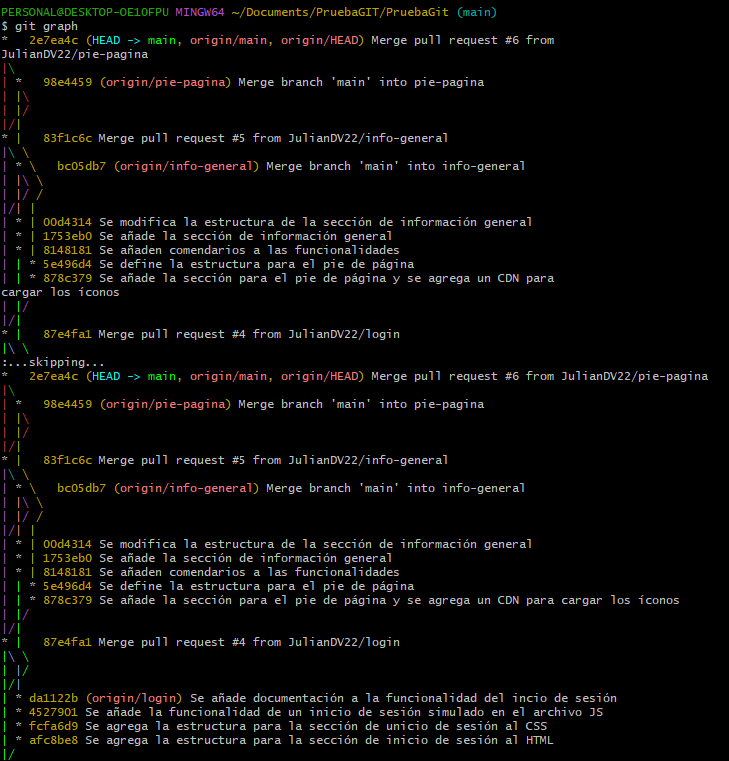
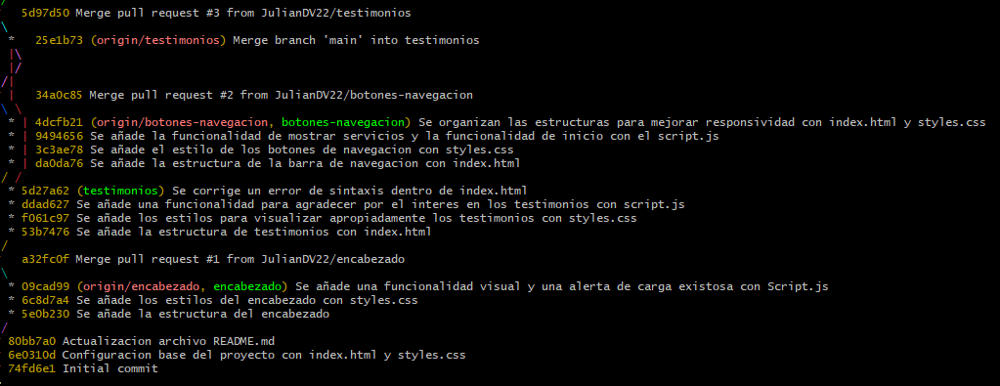

# PruebaGit

# Página Web Estática

Este repositorio contiene la base de una página web estática creada utilizando HTML y CSS. El proyecto está diseñado para servir como una introducción al desarrollo web estático y para facilitar la colaboración en equipo.

## Estructura del Proyecto

## Despliegue

El sitio se desplegará utilizando GitHub Pages una vez que se hayan completado las configuraciones necesarias.

## Contribución

Por favor, sigue las [buenas prácticas de commits](#formato-de-los-commits) al realizar cambios en el proyecto.

## Git Graph
PERSONAL@DESKTOP-OE10FPU MINGW64 ~/Documents/PruebaGIT/PruebaGit (main)
$ git graph
*   2e7ea4c (HEAD -> main, origin/main, origin/HEAD) Merge pull request #6 from JulianDV22/pie-pagina
|\
| *   98e4459 (origin/pie-pagina) Merge branch 'main' into pie-pagina
| |\
| |/
|/|
* |   83f1c6c Merge pull request #5 from JulianDV22/info-general
|\ \
| * \   bc05db7 (origin/info-general) Merge branch 'main' into info-general
| |\ \
| |/ /
|/| |
| * | 00d4314 Se modifica la estructura de la sección de información general
| * | 1753eb0 Se añade la sección de información general
| * | 8148181 Se añaden comendarios a las funcionalidades
| | * 5e496d4 Se define la estructura para el pie de página
| | * 878c379 Se añade la sección para el pie de página y se agrega un CDN para cargar los íconos
| |/
|/|
* |   87e4fa1 Merge pull request #4 from JulianDV22/login
|\ \
:...skipping...
*   2e7ea4c (HEAD -> main, origin/main, origin/HEAD) Merge pull request #6 from JulianDV22/pie-pagina
|\
| *   98e4459 (origin/pie-pagina) Merge branch 'main' into pie-pagina
| |\
| |/
|/|
* |   83f1c6c Merge pull request #5 from JulianDV22/info-general
|\ \
| * \   bc05db7 (origin/info-general) Merge branch 'main' into info-general
| |\ \
| |/ /
|/| |
| * | 00d4314 Se modifica la estructura de la sección de información general
| * | 1753eb0 Se añade la sección de información general
| * | 8148181 Se añaden comendarios a las funcionalidades
| | * 5e496d4 Se define la estructura para el pie de página
| | * 878c379 Se añade la sección para el pie de página y se agrega un CDN para cargar los íconos
| |/
|/|
* |   87e4fa1 Merge pull request #4 from JulianDV22/login
|\ \
| |/
|/|
| * da1122b (origin/login) Se añade documentación a la funcionalidad del incio de sesión
| * 4527901 Se añade la funcionalidad de un inicio de sesión simulado en el archivo JS
| * fcfa6d9 Se agrega la estructura para la sección de unicio de sesión al CSS
| * afc8be8 Se agrega la estructura para la sección de inicio de sesión al HTML
|/
*   5d97d50 Merge pull request #3 from JulianDV22/testimonios
|\
| *   25e1b73 (origin/testimonios) Merge branch 'main' into testimonios
| |\
| |/
|/|
* |   34a0c85 Merge pull request #2 from JulianDV22/botones-navegacion
|\ \
| * | 4dcfb21 (origin/botones-navegacion, botones-navegacion) Se organizan las estructuras para mejorar responsividad con index.html y styles.css
| * | 9494656 Se añade la funcionalidad de mostrar servicios y la funcionalidad de inicio con el script.js
| * | 3c3ae78 Se añade el estilo de los botones de navegacion con styles.css
| * | da0da76 Se añade la estructura de la barra de navegacion con index.html
|/ /
| * 5d27a62 (testimonios) Se corrige un error de sintaxis dentro de index.html
| * ddad627 Se añade una funcionalidad para agradecer por el interes en los testimonios con script.js
| * f061c97 Se añade los estilos para visualizar apropiadamente los testimonios con styles.css
| * 53b7476 Se añade la estructura de testimonios con index.html
|/
*   a32fc0f Merge pull request #1 from JulianDV22/encabezado
|\
| * 09cad99 (origin/encabezado, encabezado) Se añade una funcionalidad visual y una alerta de carga existosa con Script.js
| * 6c8d7a4 Se añade los estilos del encabezado con styles.css
| * 5e0b230 Se añade la estructura del encabezado
|/
* 80bb7a0 Actualizacion archivo README.md
* 6e0310d Configuracion base del proyecto con index.html y styles.css
* 74fd6e1 Initial commit

